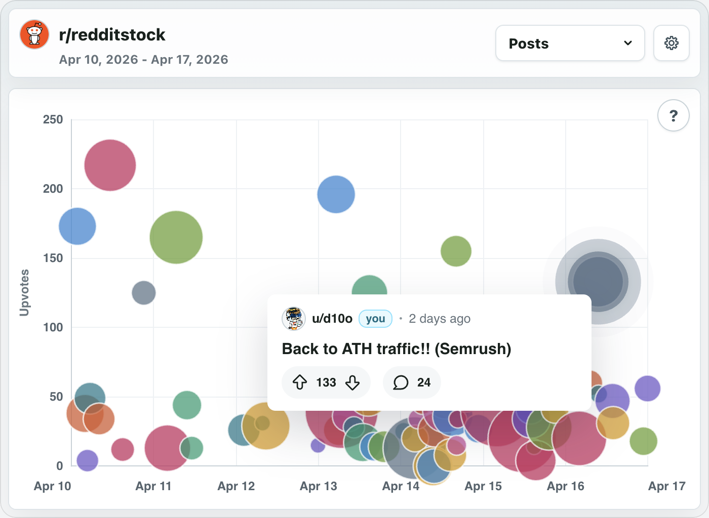
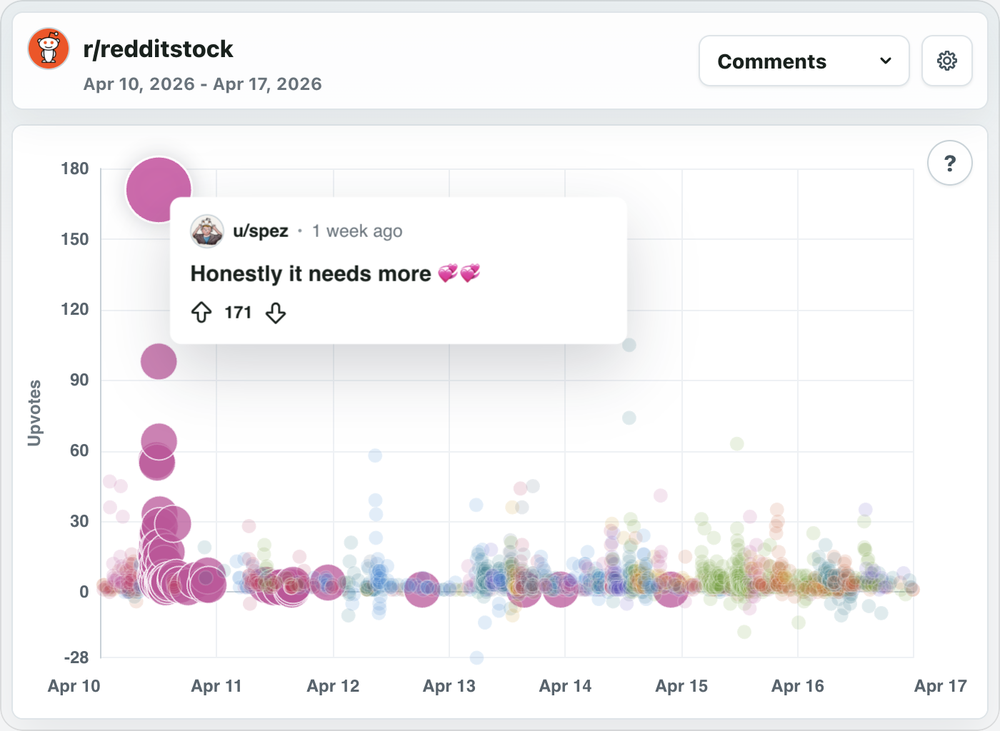
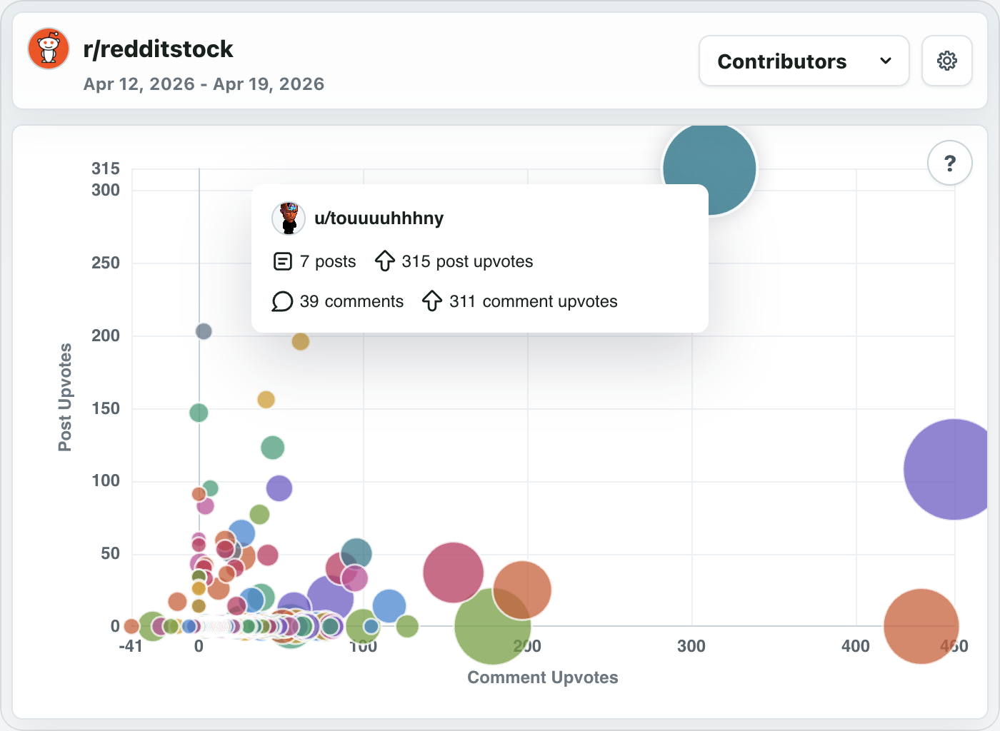
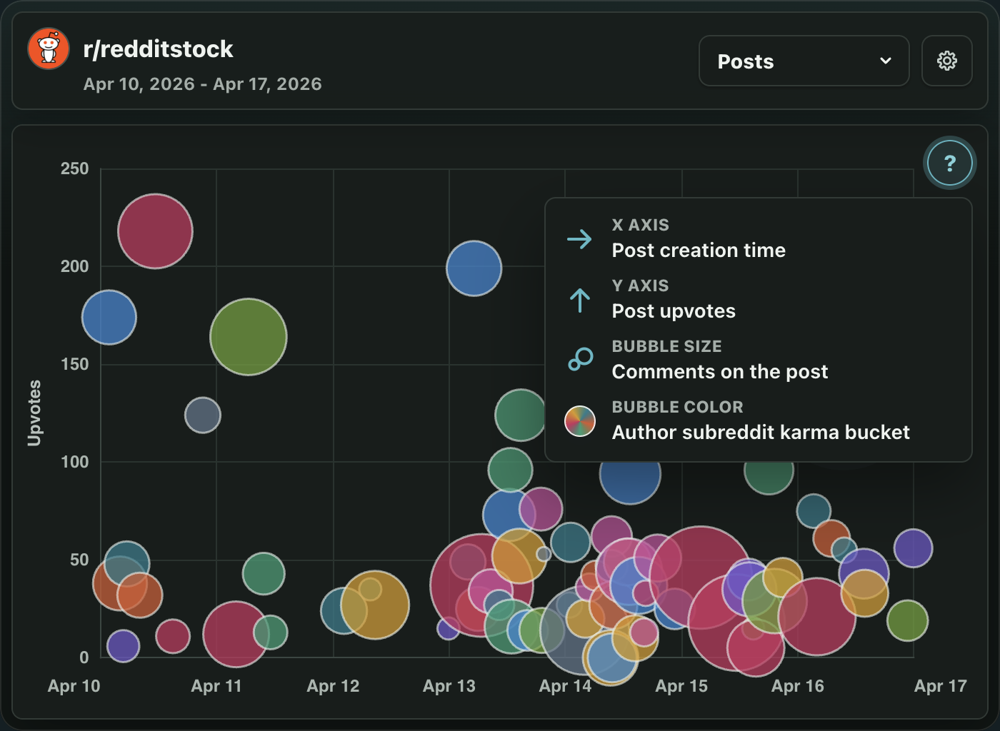

# Bubbles Never Lie

Every subreddit has a pulse. Bubbles Never Lie makes that pulse visible.

It turns the daily drift of posts, comments, votes, and familiar names into a
bright little constellation that your community can poke, compare, and argue
about. The point is not to rank people, crown winners, or turn moderation into a
spreadsheet. The point is to make the shape of a day feel obvious.

Busy hours pop. Quiet stretches breathe. Odd little outliers float to the
surface. The regulars are there, the surprise hits are there, and the "wait,
when did that happen?" moments are suddenly much easier to spot.

For mods, it is a lightweight ritual: drop a chart post, let the subreddit read
itself, repeat whenever the vibes need receipts.

## Screenshots

### Posts

### Comments

### Contributors

### Hint

## Why Install It?

- Give your community a playful way to look back at recent activity.
- Make recap posts without hand-building recaps.
- Spot weird spikes, sleeper threads, and conversation-heavy moments.
- Add a visual toy that still says something real.

## Installer Notes

After installing, moderators get a subreddit menu item named **Bubbles Never Lie:
New Post**. It creates a chart post for a recent date range.

To create a chart post:

1. Open the subreddit moderation menu.
2. Select **Bubbles Never Lie: New Post**.
3. Choose a title, start date, timezone, and 1-to-7-day range.
4. Submit the form. The app creates the post and opens it on Reddit.

New installs may show partial charts for the first few minutes while recent
activity fills in. Comment and contributor details can appear a little later
than post activity.

## Permissions

Creating a Bubbles Never Lie chart post requires moderator permissions in the
subreddit. Once the post is published, anyone on Reddit who can view the
subreddit can open and interact with the chart.
